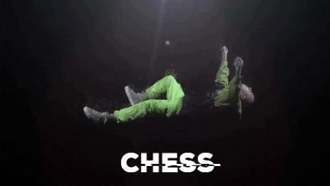

<h1 align="center">Yo, it's Rishi Ranjan ✌️</h1>

  

 
  

---

## &nbsp;🏆 GitHub Profile Trophy

## 👨‍💻  &nbsp;About Me 
- 📈 I'm **Multilingual** coder
- 🌱 Learning **Data Structure and Algorithm**
- 💪🏻 **500+ CP Solved**
- 🏢 Building **CohortLab**
- 💖 Love **Machine Learning, Generative AI, MERN, Blockchain & Web3.O**
- 💻 **5⭐** on **HackerRank**
- 📫 Feel free to contact me : **101rishidsr@gmail.com**
- ⚡ Fun fact **I am memer and formula 1 lover**

## 📈  &nbsp;Technical Skills and Expertise
**Programming Languages:**

**Front-end Frameworks:**

**Back-end Frameworks:**

**Databases:**

**Version Control & Collaboration:**

**Cloud Platforms:**

**Design & Prototyping:**

**Data Visualization:**

**Development Tools:**

**Machine Learning:**

**Linux:**

**3D Modeling & CAD:**

**Containerization & Orchestration:**

**State Management:**

## ⚙️ &nbsp;GitHub Analytics

 

## 🔥 Streak Stats

<!-- GitHub Readme Streak Stats - https://github.com/DenverCoder1/github-readme-streak-stats -->

  
  
 Keep Pushing🔥 

## 🙋‍♀️ Let's Connect

	
	
<!-- 	 -->
	
	

## &nbsp;🏆 Holopin board 

##

## Tim's Community Chess Tournament

**Game is in progress.** This is open to ANYONE to play the next move. That's the point. :wave:  It's your turn! Move a black (solid) piece.

|   | A | B | C | D | E | F | G | H |
| - | - | - | - | - | - | - | - | - |
| 8 |  |  |  |  |  |  |  |  |
| 7 |  |  |  |  |  |  |  |  |
| 6 |  |  |  |  |  |  |  |  |
| 5 |  |  |  |  |  |  |  |  |
| 4 |  |  |  |  |  |  |  |  |
| 3 |  |  |  |  |  |  |  |  |
| 2 |  |  |  |  |  |  |  |  |
| 1 |  |  |  |  |  |  |  |  |

#### **BLACK (solid):** It's your move... to choose _where_ to move...

| FROM | TO - _just click one of the links_ :) |
| ---- | -- |
| **A7** | [A5](https://github.com/RiH-137/RiH-137/issues/new?title=chess%7Cmove%7Ca7a5%7C36019&body=Just+push+%27Submit+new+issue%27.+You+don%27t+need+to+do+anything+else.) , [A6](https://github.com/RiH-137/RiH-137/issues/new?title=chess%7Cmove%7Ca7a6%7C36019&body=Just+push+%27Submit+new+issue%27.+You+don%27t+need+to+do+anything+else.) |
| **B7** | [B5](https://github.com/RiH-137/RiH-137/issues/new?title=chess%7Cmove%7Cb7b5%7C36019&body=Just+push+%27Submit+new+issue%27.+You+don%27t+need+to+do+anything+else.) , [B6](https://github.com/RiH-137/RiH-137/issues/new?title=chess%7Cmove%7Cb7b6%7C36019&body=Just+push+%27Submit+new+issue%27.+You+don%27t+need+to+do+anything+else.) |
| **B8** | [A6](https://github.com/RiH-137/RiH-137/issues/new?title=chess%7Cmove%7Cb8a6%7C36019&body=Just+push+%27Submit+new+issue%27.+You+don%27t+need+to+do+anything+else.) , [C6](https://github.com/RiH-137/RiH-137/issues/new?title=chess%7Cmove%7Cb8c6%7C36019&body=Just+push+%27Submit+new+issue%27.+You+don%27t+need+to+do+anything+else.) , [D7](https://github.com/RiH-137/RiH-137/issues/new?title=chess%7Cmove%7Cb8d7%7C36019&body=Just+push+%27Submit+new+issue%27.+You+don%27t+need+to+do+anything+else.) |
| **C8** | [D7](https://github.com/RiH-137/RiH-137/issues/new?title=chess%7Cmove%7Cc8d7%7C36019&body=Just+push+%27Submit+new+issue%27.+You+don%27t+need+to+do+anything+else.) , [E6](https://github.com/RiH-137/RiH-137/issues/new?title=chess%7Cmove%7Cc8e6%7C36019&body=Just+push+%27Submit+new+issue%27.+You+don%27t+need+to+do+anything+else.) , [F5](https://github.com/RiH-137/RiH-137/issues/new?title=chess%7Cmove%7Cc8f5%7C36019&body=Just+push+%27Submit+new+issue%27.+You+don%27t+need+to+do+anything+else.) , [G4](https://github.com/RiH-137/RiH-137/issues/new?title=chess%7Cmove%7Cc8g4%7C36019&body=Just+push+%27Submit+new+issue%27.+You+don%27t+need+to+do+anything+else.) , [H3](https://github.com/RiH-137/RiH-137/issues/new?title=chess%7Cmove%7Cc8h3%7C36019&body=Just+push+%27Submit+new+issue%27.+You+don%27t+need+to+do+anything+else.) |
| **D8** | [A5](https://github.com/RiH-137/RiH-137/issues/new?title=chess%7Cmove%7Cd8a5%7C36019&body=Just+push+%27Submit+new+issue%27.+You+don%27t+need+to+do+anything+else.) , [B6](https://github.com/RiH-137/RiH-137/issues/new?title=chess%7Cmove%7Cd8b6%7C36019&body=Just+push+%27Submit+new+issue%27.+You+don%27t+need+to+do+anything+else.) , [C7](https://github.com/RiH-137/RiH-137/issues/new?title=chess%7Cmove%7Cd8c7%7C36019&body=Just+push+%27Submit+new+issue%27.+You+don%27t+need+to+do+anything+else.) , [D7](https://github.com/RiH-137/RiH-137/issues/new?title=chess%7Cmove%7Cd8d7%7C36019&body=Just+push+%27Submit+new+issue%27.+You+don%27t+need+to+do+anything+else.) |
| **E7** | [E5](https://github.com/RiH-137/RiH-137/issues/new?title=chess%7Cmove%7Ce7e5%7C36019&body=Just+push+%27Submit+new+issue%27.+You+don%27t+need+to+do+anything+else.) , [E6](https://github.com/RiH-137/RiH-137/issues/new?title=chess%7Cmove%7Ce7e6%7C36019&body=Just+push+%27Submit+new+issue%27.+You+don%27t+need+to+do+anything+else.) |
| **E8** | [D7](https://github.com/RiH-137/RiH-137/issues/new?title=chess%7Cmove%7Ce8d7%7C36019&body=Just+push+%27Submit+new+issue%27.+You+don%27t+need+to+do+anything+else.) |
| **F6** | [D5](https://github.com/RiH-137/RiH-137/issues/new?title=chess%7Cmove%7Cf6d5%7C36019&body=Just+push+%27Submit+new+issue%27.+You+don%27t+need+to+do+anything+else.) , [D7](https://github.com/RiH-137/RiH-137/issues/new?title=chess%7Cmove%7Cf6d7%7C36019&body=Just+push+%27Submit+new+issue%27.+You+don%27t+need+to+do+anything+else.) , [E4](https://github.com/RiH-137/RiH-137/issues/new?title=chess%7Cmove%7Cf6e4%7C36019&body=Just+push+%27Submit+new+issue%27.+You+don%27t+need+to+do+anything+else.) , [G4](https://github.com/RiH-137/RiH-137/issues/new?title=chess%7Cmove%7Cf6g4%7C36019&body=Just+push+%27Submit+new+issue%27.+You+don%27t+need+to+do+anything+else.) , [G8](https://github.com/RiH-137/RiH-137/issues/new?title=chess%7Cmove%7Cf6g8%7C36019&body=Just+push+%27Submit+new+issue%27.+You+don%27t+need+to+do+anything+else.) , [H5](https://github.com/RiH-137/RiH-137/issues/new?title=chess%7Cmove%7Cf6h5%7C36019&body=Just+push+%27Submit+new+issue%27.+You+don%27t+need+to+do+anything+else.) |
| **G7** | [G5](https://github.com/RiH-137/RiH-137/issues/new?title=chess%7Cmove%7Cg7g5%7C36019&body=Just+push+%27Submit+new+issue%27.+You+don%27t+need+to+do+anything+else.) , [G6](https://github.com/RiH-137/RiH-137/issues/new?title=chess%7Cmove%7Cg7g6%7C36019&body=Just+push+%27Submit+new+issue%27.+You+don%27t+need+to+do+anything+else.) |
| **H7** | [H5](https://github.com/RiH-137/RiH-137/issues/new?title=chess%7Cmove%7Ch7h5%7C36019&body=Just+push+%27Submit+new+issue%27.+You+don%27t+need+to+do+anything+else.) , [H6](https://github.com/RiH-137/RiH-137/issues/new?title=chess%7Cmove%7Ch7h6%7C36019&body=Just+push+%27Submit+new+issue%27.+You+don%27t+need+to+do+anything+else.) |
| **H8** | [G8](https://github.com/RiH-137/RiH-137/issues/new?title=chess%7Cmove%7Ch8g8%7C36019&body=Just+push+%27Submit+new+issue%27.+You+don%27t+need+to+do+anything+else.) |

**Notice a problem?**

Raise an [issue](https://github.com/RiH-137/RiH-137/issues).

